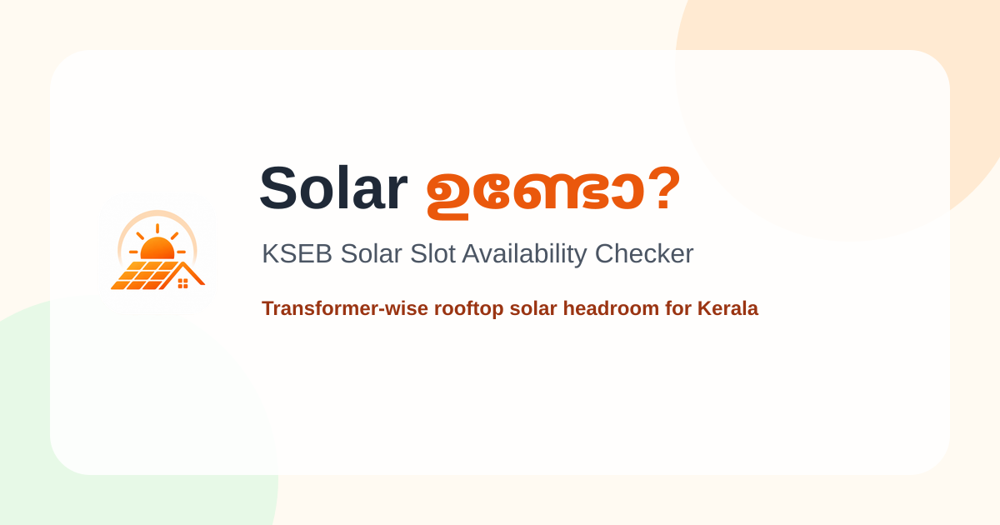

# ☀️ Solar ഉണ്ടോ? (Solar Undo?)



**Instantly check rooftop solar capacity availability for your KSEB connection — transformer-level accuracy.**

Solar ഉണ്ടോ? is a fast, responsive, and modern web application built for residents of Kerala to easily verify if their local KSEB (Kerala State Electricity Board) transformer has available capacity for new rooftop solar installations. 

## ✨ Features

- **Transformer-Level Accuracy**: Checks real-time capacity of your specific KSEB transformer.
- **Simple 3-Step Verification**: Enter consumer number, verify details, and get the result instantly.
- **Direct Integration**: Fetches data securely and directly from KSEB servers.
- **Privacy-First**: No personal data or consumer numbers are stored on our servers.
- **Mobile-First Design**: Beautiful, responsive interface designed to work flawlessly on mobile devices.
- **Dark Mode Support**: Sleek, modern aesthetic with automatic dark/light theme adaptation.

## 🛠️ Technology Stack

- **Framework**: [Next.js 16](https://nextjs.org/) (App Router)
- **Library**: [React 19](https://react.dev/)
- **Styling**: [Tailwind CSS v4](https://tailwindcss.com/)
- **UI Components**: [shadcn/ui](https://ui.shadcn.com/) + [Radix UI](https://www.radix-ui.com/)
- **State Management**: [Zustand](https://zustand-demo.pmnd.rs/)
- **Database / Backend Integration**: [Supabase](https://supabase.com/)
- **PDF Processing**: `pdf-parse` for automated data extraction workflows.

## 🚀 Getting Started

### Prerequisites

- Node.js 20+
- npm, yarn, pnpm, or bun

### Installation

1. **Clone the repository:**
   ```bash
   git clone https://github.com/yourusername/solar-undo.git
   cd solar-undo
   ```

2. **Install dependencies:**
   ```bash
   npm install
   # or yarn install / pnpm install
   ```

3. **Set up environment variables:**
   Create a `.env.local` file in the root directory and add necessary keys (e.g., Supabase URLs).
   ```bash
   cp .env.example .env.local
   ```

4. **Run the development server:**
   ```bash
   npm run dev
   ```

5. **Open the app:**
   Navigate to [http://localhost:3000](http://localhost:3000) in your browser.

## 🤝 Contributing

We welcome contributions! Please see our [CONTRIBUTING.md](./CONTRIBUTING.md) for details on how to get started.

## 🏛️ Architecture

For a deep dive into how the app connects to KSEB and manages state, check out the [ARCHITECTURE.md](./ARCHITECTURE.md) guide.

## 📄 License

This project is open-source. See the LICENSE file for details.
